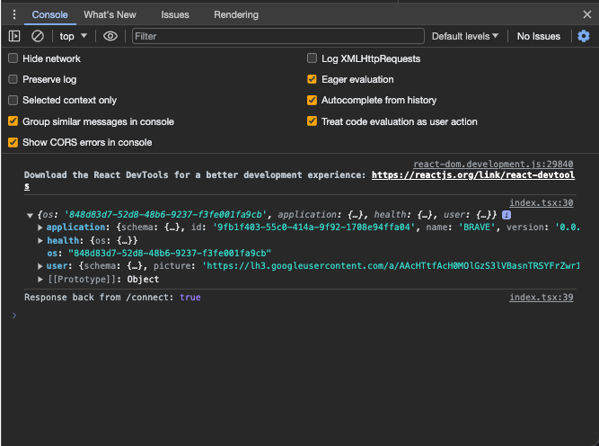

# Get Started with Pieces OS and the @pieces.app/pieces-os-client npm package

Follow this guide to get an early look at using Pieces OS in your own development environment. You can use this to get familiar with some key terms and endpoints: `assets`, `asset`, `connect`, `format`, `formats`, and `create`. There are other topics that are touched on, and further expansion on this starter project is coming soon. 

See the NPM package here: 
- [https://www.npmjs.com/package/@pieces.app/pieces-os-client](https://www.npmjs.com/package/@pieces.app/pieces-os-client)

Read our Current Documentation:
- [https://docs.pieces.app](https://docs.pieces.app)
- **Developer docs coming soon**

## Table of Contents

- [Operating System Support](#operating-system-support)
- [Installing](#installing)
    - [Pieces OS](#pieces-os)
    - [Downloading NPM Package](#downloading-npm-package)
    - [Creating Project Base](#creating-the-base-of-your-project)
    - [Installing Package Dependencies with NPM](#install-package-dependencies-with-npm)
- [Running Your Project](#running-your-project-for-the-first-time)
- [Create Connect() Function](#creating-connect-function)
- [Connecting your Application](#connecting-your-application)
  - [View Output in Browser](#view-console-output-in-your-browser)
- [Asset + /assets](#getting-started-with-asset--assets)
  - [Asset](#asset)
  - [SeededAsset](#seededasset)
- [/assets/create](#assetscreate)
- [/assets/snapshot](#assets-snapshot-assetssnapshot)
- [/asset/update](#using-assetupdate)
- [Refresh Your Snapshot](#refresh-your-snapshot)
- [/assets/delete](#delete-using-assetsdelete)

## Operating System Support

Currently, Pieces OS is utilized as the primary backend service with Pieces for Developers that powers all of the features that can be used there. Both programs are designed for full support by all operating systems, although our Linux Platform is available, it leans towards a 'heavily supported beta' and may experience incremental issues on specific flavors of linux.


## Configuration & Setup with NPM

You can choose to follow the following steps to configure your project by hand, or you can use `npx create-react-app <your-app-name>` instead.

## Installing
When developing on the Pieces platform, you need two primary things:

1. **Download the Pieces OS application**
2. **Install the npm package**

## Pieces OS
Pieces OS runs in the background of your computer and serves as a hub for all plugins and extensions developed by the team. In order to utilize your own Server locally and support all the functionality that powers things like [Global Search](https://docs.pieces.app/features/global-search), [Copilot Chats](https://docs.pieces.app/features/pieces-copilot), [Asset Saving](https://docs.pieces.app/features/managing-saved-materials), [context](https://docs.pieces.app/features/pieces-copilot#set-your-own-copilot-context), and more.

Select the right version to download Pieces OS for your operating system:
- [macOS](https://docs.pieces.app/installation-getting-started/macos) - [Compatible with macOS 11 Big Sur or higher]
- [Windows](https://docs.pieces.app/installation-getting-started/windows) - [Compatible with Windows 10 version 1809 or higher]
- [Linux](https://docs.pieces.app/installation-getting-started/linux) - [Compatible with Ubuntu 18 or Higher]

You can also visit our user facing documentation to learn more about different features that are available now to give you an idea of some of the things that you can potentially do.

## Downloading NPM Package

Using npm:

```bash
npm install @pieces.app/pieces-os-client
```

Using pnpm:

```bash
pnpm add @pieces.app/pieces-os-client
```

After you install the package, you  can import the library into your file(s) using `require`:

```js
const pieces = require('@pieces.app/pieces-os-client')
```

or you can import the package using `import` as well:

```js
import * as pieces from '@pieces.app/pieces-os-client'
```

> **Recommendation**
> The order that npm packages are saved and added to your dependencies is important and will affect your installation flow. **This slowed me down for quite a bit.**
>
> **If you are having issues with your installation, it is likely due to a conflict in Typescript versions - `npm uninstall typescript` - then go back and perform all other npm installations before reinstalling typescript again**.


### Creating the base of your project
Let's get started with the base of your new React project where we will learn about manipulating Pieces OS and creating our own assets locally on device.

##### **How your .tsconfig should look when you are done:**
```json
{  
  "compilerOptions": {  
    "target": "es2020",  
    "module": "CommonJS",  
     "allowJs": true,  
     "checkJs": true,  
     "maxNodeModuleJsDepth": 1,  
    "forceConsistentCasingInFileNames": true,
    "strict": false,  
    "skipLibCheck": true,
    "jsx": "react"  
  },  
  "exclude": ["node_modules"]  
}
```

### Install Package Dependencies with npm

#### Need this if you are going to work with ts files
```bash
npm install typescript 
```

I also recommend installing `ts-node` to get the proper commands running and to run individual test files directly from cmd line. Here is that:

```bash
npm install ts-node
```

Then getting the types package for node can also be super beneficially and in some cases needed to work in this environment:

```bash
npm install -D tslib @types/node
```

I ended up also installing a few react libraries to get a more visual experience while learning about the api itself.

Here are those npm commands for `@types`:

```bash 
npm install @types/react && npm install @types/react-dom 
```

Along with the typing, you will need to install the full packages for react, react-dom, and react scripts to properly get started in this project.

```bash
npm install react && npm install react-dom && npm install react-scripts
```

And last but not least it's a good idea to add a few scripts into your `package.json` to help with development:

```json
{ 
  "scripts": {
    "dev": "ts-node index.tsx",
    "clean": "rm -r node_modules && rm package-lock.json",
    "start": "react-scripts start",
    "build": "react-scripts build"
  }
}
```

> **Don't Forget**
> You can run any script that you add here via `npm run <your-script>`. For example to run "start" you would simple run `npm run start`

## Setting up your `public` Directory
Next you can go ahead and create a new directory called `public` that will hold your `index.html` file where your entry point exists. Create the file inside of public and save it there. You do not have to add anything to the `index.html` file at this time, as we will come back to this later. If you would like, you can add the following as a placeholder for now:

```html
<!DOCTYPE html>  
<html lang="en">  

</html>
```

## Setting up your `src` Directory
Now that the initial `.html` file has been created, you can start to work on your src directory and getting the rest of your core files added to the project.

Inside the `src` directory, add two files:
- **`singleton.ts`** - single instance container for a few global functions and features
- **`index.tsx`**- where the core info is and where we are going to be spending most of the time during this project following the setup.

Once you open `index.tsx` you should follow these steps to get your base Application window created:

1. Import the full react library at the top of your file, along with a single import from `react-dom`:
    ```tsx
    import * as React from "react";
    import { render } from 'react-dom';
    ```

2. Follow that with the full App() function and main run of the application:
    ```tsx
    function App(): React.JSX.Element {  
        return (  
            <div>  
                <h1>Hello Pieces Dev Community :)</h1>  
            </div>
        )}
    ```

3. And then add these last two lines to target the `root` element by using the ID that is on it:
    ```tsx
    const rootElement = document.getElementById("root");  
    const root = createRoot(rootElement);
    ```

> **Helpful tip**
> When working in this environment I noticed some @babel errors during the build process (or running `npm run start`) and found this workaround that you can install via npm as well [here](https://www.npmjs.com/package/@babel/plugin-transform-private-property-in-object).


## Running your Project for the First Time
Everything has been added. We are nearly there and will need to perform a final few checks before starting our dev project.

1. Be sure that Pieces OS is running
2. Double check that the port is `localhost:1000`
3. (optional) Run another npm install (because it never hurts)

Now that everything is ready to go, lets run this command here:

```bash
# remember that we added this to the scripts as: "start": "react-scripts start"
npm run start
```

And after a few seconds you should be able to see in your Chrome browser (or your primary browser) a blank window that looks like this:


##### **You have now successfully set up your dev environment, and will be ready to test different endpoints inside of Pieces OS.**

## Connecting your Application
When Pieces OS is running in the background of your machine, it is communicating with other local applications that use Pieces software, and up until recently only supporting internally built tools.

As each plugin, extension, or application initializes they 'reach out' to Pieces OS and authenticate with the application themselves. There are a number of application formats that we support and provide for each of our applications. ==When developing on Pieces OS, you can use **"LOCAL_DEV"**
to avoid any issues with other applications.==

### Creating `Application`
The `application` model describes what application a format or analytics event originated from. This is passed along when initializing your dev environment and creates a connection to Pieces OS.

To create the `Application` object for your project, you will need to make sure that you have the following three things:

1. Create a `tracked_application` json object to hold your post request data
2. Define your `url` for the `/connect` function
3. Output using `console.log()` following your `connect()` method is complete

***We will go over the different usages in each of these steps one at a time to bring up any specificities that may need a deeper explanation.***


#### `tracked_application`
Connecting your application here is as easy as a single **POST** request and can be done via the Response interface of the **Fetch Api**. Remember that you can name this whatever you would like to, just be sure to include the updated variable name in the `options` down below.

> When creating the `tracked_application` item, you will need to use a type that is not available inside the current `npm_deployment`.
>
> This structure is the same as the tracked_application full example you see here below, and the only difference from the unavailable type `SeededTrackedApplication` and the available type `TrackedApplication` is `id: number`.

First lets take a look at the `tracked_application` object:

```tsx
const tracked_application = {  
    name: Pieces.ApplicationNameEnum.Brave,  
    version: '0.0.1',  
    platform: Pieces.PlatformEnum.Macos,  
}
```

- **name**: Brave
- **platform**: Depending on your current environment, you need to set the platform parameter to match your current operating system. Select between `.Macos`, `.Windows`, `.Linux`

> **Imports**
> Be sure to double-check that you have the following import added to the first few lines of your `index.tsx` file if you have not already: `import * as Pieces from "@pieces.app/pieces-os-client";`

### Creating `connect()` Function
When your program starts, it needs to connect to Pieces OS to gain access to any functional data and to exchange information on the `localhost:1000` route. Now that you have your `tracked_application` - lets get into the details.

Start by defining you connect function and add the initial `/connect` route to your function as the `url` variable and then attach the `options` object. Include your `tracked_application` object passed into a `JSON.stringify()` method under the `application` parameter like so:

```tsx
async function connect(): Promise<Boolean> {

	const url: string = 'http://localhost:1000/connect';

	const options: {method: string, body: string} = {  
	    method: 'POST',  
	    body: JSON.stringify({ application: tracked_application}  
    ),
  }
}
```

Now let's add few more things to this file
- **`_flag: Boolean`** - for marking the success or failure of the try catch
- **try, catch**
    - `response` - for capturing the fetch response back from OS Server
    - `data` - for storing the data and logging it
    - `e` - error that is coming back if the response fails

#### Running `connect().then()`:
This will just run the connect function and then log the response in your console, inside your
browser:

```tsx
connect().then( __ => console.log("Response back from /connect:", __ ));
```

Below this final line should be:
- `function App() ...`
- `const rootElement ...`
- `root.render(...)`

Here is the entire connection function for you to double-check your work:

```tsx
async function connect(): Promise<JSON> {

    const url: string = 'http://localhost:1000/connect';
    const options: {method: string, body: string} = {
        method: 'POST',
        body: JSON.stringify({ application: tracked_application}
        ),
    }

    let _output: Promise<JSON>;

    try {
        const response: Response = await fetch(url, options);
        const data: Promise<JSON> = await response.json();
        _output = data;
        return _output;
    } catch (e) {
        console.error(e);
    }

}
```


## View Console Output in your Browser
Now that everything has been correctly configured (fingers crossed) you can run your sample application and connect to Pieces OS for the first time.

Inside your terminal at the root directory of your project, use NPM to run one of the scripts that we added to the package.json file called "start":

```bash 
npm run start
```

And you should have the same content in the main browser window as before once this completes. But if you open up your inspector using `cmd+option+i` or `ctrl+shift+c` you will see this inside of your console:



This includes both the full OS response object with all the data that you will need to get going with other endpoints, and your application is now connected and ready to go for the rest of your exploration and discovery!

Follow along with these next steps to learn about **assets and formats,** two things that are very important for managing any form of data with Pieces OS.

## Getting Started with `Asset` + `/assets`
**Asset** is a very important models who's primary purpose is to manage the seeded data that comes in to the application, and is stored inside of Pieces OS. Each asset is a identifiable piece of saved data, or pre-seeded data.

**Assets** is equally important, but instead of containing a single asset with parameters storing data on it, Assets serves as the list of `type: Asset` objects that are stored there. Also you will find the operations for adding, deleting, searching, and other functions that are related to referencing a number of different snippets to make a comparison. For instance:

> If I want to create a snippet (lets call it `var`), I need to send this to the master `Assets` list, you would first create `var` itself with the proper formats and data added to the `var` object, then send the newly created SeededAsset over to the Assets list (assets/create). Then you will receive the asset back as the response from the server. Cool, right?

> **HEY! Read this.**
> Traditionally, `Assets` is a linear list of flat `Asset` objects stored in an array or list.
>
> **You can use identifiers to get a specific asset from the asset list called a UUID.** But you'll learn more about that later on.

### `Asset`
Initially when creating your application, you will have no snippets saved to your project, will not be signed in, and you will have not completed onboarding. These are properties that you may see during this creation.

> Check out `localhost:1000/assets` while Pieces OS is running to see the empty object that is there.

#### **Creating your First Asset**
While creating an asset, there are some required parameters that you will need to be sure to include the proper **format** data.

> **Explaining Format**
>
> For each `Asset` object, each required parameter must be included, and the Asset must be seeded before it is sent to be created.

#### SeededAsset
This seed data will become the asset. You can use this structure to provide data to Pieces OS, and will include fewer parameters than what you will get back in your response. Lets get started with the seeded asset formatting before we pass this over to `/Assets`.

At the top level of this object you will see:

- `schema`
- `metadata`
- **`application`** (required)
- **`format`** (required)
- `discovered`
- `available`


`Schema`, `metadata`, `discovered` and `available` are all parameters that have extensive use cases, but for now we are going to focus on `application` & `format` - the two required formats for this object.

With each call you need to include your application object that you created earlier - and we can do this inside of the .then() following the return from `connect()` which is defined here:

```tsx
connect().then(__ => {
    // parsing this value and restringifying it properly gives it its type.
    full_context = __;
    let _t = JSON.parse(JSON.stringify(full_context));
    applicationData = _t.application;
    console.log('Application Data: ', applicationData);

})
```


### `/assets/create`
Now before continuing forward, we will need to prepare the `create()` function to connect to the proper `Assets/create` endpoint. Create slightly differs from connect, since previously our json object did not require any new data that was returned back from the server. In this case **we will need to include the application data that was returned back from our initial call to `/connect`.**

The `create()` function needs to accomplish a few things:

1. Create a new asset using our simple `SeededAsset` configuration that we just created as the `seed` object
2. Send a POST request to the new `http://localhost:1000/assets/create` with out data
3. Return the response back after this is completed
    
Here is what the `create()` function looks like in its entirety:

```tsx
function createAsset() {
    let _seededAsset: SeededAsset = {
        application: applicationData,
        format: {
            fragment: {
                string: { raw: data },
            },
        },
        metadata: {
            name: name
        }
    }

    // create your seed
    let _seed: Pieces.Seed = {
        asset: _seededAsset,
        type: SeedTypeEnum.Asset
    }
}
```

Now that we have the create function created, all that is left is to call `create()` and log our new asset to the console!

You can add this final call to the end of the `connect.then()`:

```tsx
// make your api call.
new Pieces.AssetsApi().assetsCreateNewAsset({seed: _seed}).then(_a => {
    console.log("well howdy", _a);
})
```

#### Response
Once you receive your response back from Pieces OS, you will notice the drastic difference in the response back here. There is quite a long list of parameters that you can store alongside your assets to make them more powerful.

The response back will look similar to the following: [https://jwaf.pieces.cloud/?p=24e242a85e](https://jwaf.pieces.cloud/?p=24e242a85e)


## Assets Snapshot (assets/snapshot)
Now when you follow this guide, you will be receiving this data back from inside your console in the browser. But if you would like to view your data incrementally through the full browser window, you can navigate to `http://localhost:1000/assets` to view a full list of snippets that have been saved.

As you move through your assets there are a number of things you may need your full assets list for without needing all of your data. (for example: the list view and carousel views in Pieces for Developers)

To get your assets snapshot, you can use this to list each asset: 

```tsx
new Pieces.AssetsApi().assetsSnapshot({}).then(_assetList => {
    for (let i = 0; i < _assetList.iterable.length; i++) {
        // this will log the asset to the console.
       console.log(_assetsList[i]);
    }
})
```

Each asset will have and ID on it that can be used to match a singular asset here. Very useful when trying to get a specific asset from your full assetsSnapshot.

## Using asset/update
Individual assets can be manipulated with a number of different properties and metadata. You can add **titles**, **annotations**, **tags**, **links**, **anchors**, and much more all through this single endpoint. To use it properly first use the assetSnapshot to get your asset using its ID property, and store your asset in a variable in your `.then()`. You can then adjust any of the properties on this asset you have stored on `_asset`, then pass into `requestParameters` on the `assetUpdate` endpoint. 

Check out this code block with an example of how to rename an asset:

```tsx
function renameAsset(_name: string, _id: String){
    new Pieces.AssetsApi().assetsSnapshot({}).then(_assetList => {
        for (let i = 0; i < _assetList.iterable.length; i++) {
            if (_assetList.iterable[i].id == _id) {

                let _asset = _assetList.iterable[i];

                _asset.name = _name;

                new Pieces.AssetApi().assetUpdate({asset: _asset}).then(_updated => {
                    console.log("updated:", _updated);
                })
            }
        }
    })
}
```

Then inside your UI you can connect the renameAsset() function to your button and text inputs. Note that in order to perform this operation you need both the id of the asset, and also the new name that you would like to update you asset to. 

The code block below includes the state management for the text input, along with the button that initiates the asset update as well.

This is what that looks like: 

```tsx
function RenameAssetInput() {
    const [name, setNameValue] = useState('');
    const [id, setIdValue] = useState('');

    const handleNameChange = (event) => {
        setNameValue(event.target.value);
    };

    const handleIdChange = (event) => {
        setIdValue(event.target.value);
    };

    return (
        <>
            <p>Name:</p>
            <input value={name} style={{ width: '450px', verticalAlign: 'top' }} onChange={handleNameChange} />
            <p>ID:</p>
            <input value={id} style={{ width: '450px', verticalAlign: 'top' }} onChange={handleIdChange} />
            <button style={{ marginTop: '10px', maxWidth: '200px' }} onClick={() => renameAsset(name, id)}>Rename Snippet</button>
        </>

    );
}
```

## Refresh Your Snapshot
In order to get updates to your assetSnapshot as a whole, you may need to update you local list in order to reflect changes that come from Pieces OS and give information on the assets stored there. In order to perform a refresh you can use this code block here: 

```tsx
const [array, setArray] = useState([]);

const refresh = (_newAsset: LocalAsset) => {
    setArray(prevArray => [...prevArray, _newAsset])
}

function refreshSnippetList() {
    new Pieces.AssetsApi().assetsSnapshot({}).then((assets) => {
        
        // loop through your assets.
        for (let i = 0; i < assets.iterable.length; i++) {
            let _local: LocalAsset = {
                id: assets.iterable[i].id,
                name: assets.iterable[i].name,
                classification: assets.iterable[i].original.reference.classification.specific
            }

            refresh(_local);

        }
    })
}
```

I added this to the top level for reactivity inside the main `App()` call. You can choose to place this in a different location if you are not in need of any reactive data.

## Delete Using /assets/delete

Assets can be deleted from your Assets list entirely by passing them into the `assetsDeleteAsset` endpoint. Just like the above example to rename a specific asset, you will need the ID of the asset that you are trying to remove. In order to get that you will need to use assetSnapshot in tandem with your delete endpoint: 

```tsx
 new Pieces.AssetsApi().assetsSnapshot({}).then(_assetList => {
    for (let i = 0; i < _assetList.iterable.length; i++) {
        if (_assetList.iterable[i].id == _id) {
            new Pieces.AssetsApi().assetsDeleteAsset({asset: _assetList.iterable[i].id }).then(_ => console.log("delete confirmed!"))
        }
    }
})
```

After a successful delete, you may have to reload your browser window in order to see the updated snippet list.


> **Recommendation**  
> We use [JSON Viewer](https://chrome.google.com/webstore/detail/json-viewer/gbmdgpbipfallnflgajpaliibnhdgobh) internally when developing and **recommend** using some form of web based extension that assists with reading JSON DATA


## Conclusion
This is a very simple guide on how to get up and running using the @pieces.app/pieces-os-client npm package and create a web environment that you can build on top of. **Fork this repo** to get started and learn about the depth of possibilities you have with Pieces OS.

More guides will be coming soon around:
- Creating a personal Copilot that understands your context
- Examples on `/search` endpoints
- Improvements to the project structure + UI
- Testing custom implementations and combining endpoints
- ...more! 